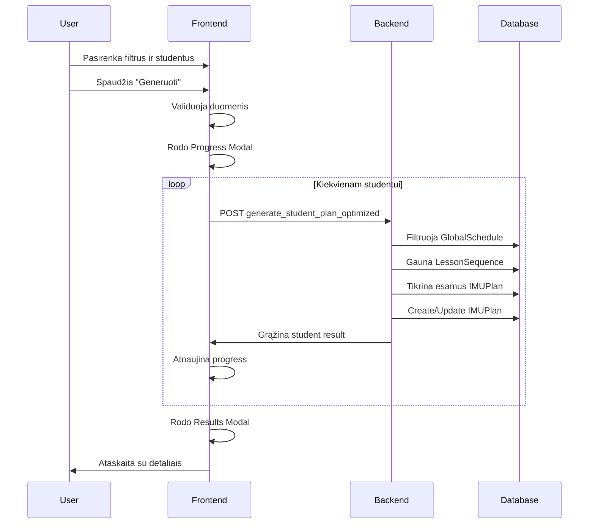

# /DOC/IMU-PLAN-GENERATION.md

# Individualių Mokinių Ugdymo Planų Generavimo Sistema

## PROJEKTO APŽVALGA

Ši dokumentacija aprašo **Per-Student Progressive API** sprendimą IMU planų generavimui A-DIENYNAS sistemoje. Sistema leidžia mentoriams automatiškai sukurti individualius ugdymo planus studentams pagal pasirinktus kriterijus su real-time progress tracking ir detalaus rezultatų raportavimu.

## ARCHITEKTONINIS SPRENDIMAS

### **Pasirinktas Sprendimo Variantas**
**Per-Student API su optimizacijomis** - kiekvienam studentui atskirai generuojami planai su:
- Real-time progress modal 
- Detaliais rezultatų raportais
- Graceful error handling
- Client-side optimization

### **Privalumai**
- ✅ **UX Priority** - aiškus realaus laiko progress feedback
- ✅ **Error Isolation** - vieno studento klaida nesugadina viso proceso
- ✅ **Detailed Reporting** - tikslūs per-student rezultatai su skip priežastimis
- ✅ **Resume Capability** - galima pratęsti po klaidos
- ✅ **Simple Infrastructure** - nereikia WebSocket/Celery

## SISTEMOS KOMPONENTAI

### **1. Backend Komponentai**

#### **1.1 Serializer (backend/plans/serializers.py)**
```python
class GenerateIMUPlanSerializer(serializers.Serializer):
    student_id = serializers.IntegerField()
    subject_id = serializers.IntegerField() 
    level_id = serializers.IntegerField()
    lesson_sequence_id = serializers.IntegerField()
    start_date = serializers.CharField(max_length=10)
    end_date = serializers.CharField(max_length=10)
```

#### **1.2 API Endpoint (backend/plans/views.py)**
```python
@action(detail=False, methods=['post'])
def generate_student_plan_optimized(self, request):
    # POST /api/plans/sequences/generate_student_plan_optimized/
```

**Payload:**
```json
{
    "student_id": 1,
    "subject_id": 2,
    "level_id": 3, 
    "lesson_sequence_id": 4,
    "start_date": "2025-01-15",
    "end_date": "2025-02-15"
}
```

**Response:**
```json
{
    "student_id": 1,
    "student_name": "Jonas Jonaitis",
    "processed": 8,
    "created": 6,
    "updated": 2,
    "skipped": 0,
    "null_lessons": 0,
    "unused_lessons": [],
    "skipped_details": [],
    "info_message": "Nerasta tvarkaraščio įrašų laikotarpyje 2025-01-16 - 2025-01-16 dalykui ir lygiui"
}
```

**Galimi atsakymo tipai:**
- **Sėkmingas procesavimas:** `created`, `updated`, `skipped` > 0
- **Tuščias rezultatas:** `processed: 0` + `info_message` 
- **Klaida:** `error` field su klaidos aprašymu

### **2. Frontend Komponentai**

#### **2.1 Progress Modal (frontend/src/components/ui/ProgressModal.tsx)**
- Realaus laiko progreso rodymas
- Dabartinio studento info
- Progress bar su procentais
- Studentų indikatorių grid
- Cancel funkcionalumas

#### **2.2 Results Modal (frontend/src/components/ui/GenerationResultsModal.tsx)**  
- Bendra statistika (sukurta/atnaujinta/praleista)
- Per-student detalūs rezultatai
- Expandable skipped details
- Unused lessons tracking
- Error reporting

#### **2.3 Enhanced DualListTransfer (frontend/src/components/ui/DualListTransfer.tsx)**
- Generate mygtukas su loading state
- Integration su progress sistema
- Disabled state during generation

## DUOMENŲ SRAUTO DIAGRAMOS

### **Proceso Eiga**


## DUOMENŲ FILTRAVIMO LOGIKA

### **GlobalSchedule Filtravimas**
```python
schedules = GlobalSchedule.objects.filter(
    subject_id=data['subject_id'],
    level_id=data['level_id'],
    date__gte=start_date,     # >=
    date__lte=end_date        # <=
).select_related(
    'period', 'subject', 'level', 'classroom', 'user'
).order_by('date', 'period__starttime')
```

### **Length Mismatch Handling**
```python
# Scenarijus A: Daugiau schedule nei lessons
if i < len(lessons):
    current_lesson = lessons[i].lesson
else:
    current_lesson = None  # NULL assignment
    result['null_lessons'] += 1

# Scenarijus B: Daugiau lessons nei schedule  
if len(lessons) > len(schedules):
    unused_lessons = lessons[len(schedules):]
    result['unused_lessons'] = [...]
```

### **Status Validation**
```python
if existing and existing.status != 'planned':
    result['skipped'] += 1
    result['skipped_details'].append({
        'date': schedule.date.strftime('%Y-%m-%d'),
        'period_info': f"{schedule.period.name}...",
        'reason': f"Status '{existing.get_status_display()}' - cannot overwrite"
    })
    continue
```

## ERROR HANDLING STRATEGIJA

### **Backend Error Types**
1. **Validation Errors** - neteisingi duomenys
2. **Not Found Errors** - neegzistuojantys įrašai  
3. **Permission Errors** - neužrašyti statusai
4. **Unexpected Errors** - sistemos klaidos

### **Frontend Error Handling**
```typescript
try {
    const response = await api.post('/plans/sequences/generate_student_plan_optimized/', payload);
    allResults.push(response.data);
} catch (error: any) {
    const errorResult: StudentResult = {
        student_id: student.id,
        student_name: student.name,
        // ... defaults
        error: error.response?.data?.error || error.message || 'Nežinoma klaida'
    };
    allResults.push(errorResult);
}
```

## LOGGING SISTEMA

### **Backend Logging**
```python
import logging
logger = logging.getLogger(__name__)

# Critical decision points
logger.info(f"Filtering criteria: subject={data['subject_id']}, level={data['level_id']}")
logger.info(f"Date range: {start_date} to {end_date}")
logger.info(f"Found {schedules.count()} matching schedules")

# Per-operation logging  
logger.info(f"  ASSIGN: {schedule.date} -> lesson {current_lesson.title}")
logger.info(f"  SKIPPED: {schedule.date} - status {existing.status}")
logger.info(f"  NULL LESSON: {schedule.date} (no more lessons in sequence)")
```

### **Frontend Logging**
```typescript
console.log('Starting generation with payload base:', basePayload);
console.log('Selected students:', selectedStudents);
console.log(`Processing student ${i + 1}/${selectedStudents.length}: ${student.name}`);
console.log(`Student ${student.name} result:`, response.data);
console.log('Generation completed. All results:', allResults);
```

## PERFORMANCE OPTIMIZACIJOS

### **1. Bulk Prefetch**
```python
# Išvengiam N+1 queries
existing_plans_dict = {
    plan.global_schedule_id: plan
    for plan in IMUPlan.objects.filter(
        student_id=student_id,
        global_schedule__in=schedules
    ).select_related('global_schedule')
}
```

### **2. Selected Related**
```python
schedules = GlobalSchedule.objects.filter(...).select_related(
    'period', 'subject', 'level', 'classroom', 'user'
)
```

### **3. Request Throttling**
```typescript
// Small delay between requests
if (i < selectedStudents.length - 1) {
    await new Promise(resolve => setTimeout(resolve, 100));
}
```

## GALIMOS KLAIDOS IR SPRENDIMAI

### **1. Import Klaida: `datetime is not defined`**
**Problema:** Backend error 500 - `NameError: name 'datetime' is not defined`
**Priežastis:** `datetime` importuotas funkcijos viduje, bet naudojamas helper funkcijoje
**Sprendimas:** Perkelti `datetime` ir `logging` imports į failo pradžią
```python
# backend/plans/views.py - file top
from datetime import datetime
import logging
```

### **2. Tuščias GlobalSchedule Rezultatas**
**Problema:** 400 Bad Request kai nėra tvarkaraščio įrašų pasirinktame laikotarpyje
**Priežastis:** Sistema grąžindavo error vietoj informatyvaus pranešimo
**Sprendimas:** Graceful handling su sėkmingu 200 response
```python
if not schedules:
    return Response({
        'student_id': data['student_id'],
        'student_name': student.get_full_name(),
        'processed': 0, 'created': 0, 'updated': 0, 'skipped': 0,
        'info_message': f'Nerasta tvarkaraščio įrašų laikotarpyje {start_date} - {end_date}'
    }, status=200)
```

### **3. Hydration Mismatch**
**Problema:** Server ir client render skirtingai dėl dinaminių reikšmių
**Sprendimas:** `isClient` state ir client-only rendering

### **4. Ref Compatibility**
**Problema:** Input komponentas nepalaikė ref forwarding
**Sprendimas:** `React.forwardRef` implementacija
```typescript
const Input = React.forwardRef<HTMLInputElement, InputProps>(({ ... }, ref) => {
    return <input ref={ref} {...props} />
});
```

### **5. Datos Formato Nesuderinamumas**
**Problema:** `2025-08-09` vs `2025-08-09:12:00`
**Sprendimas:** Explicit `date()` konvertavimas backend
```python
start_date = datetime.strptime(data['start_date'], '%Y-%m-%d').date()
end_date = datetime.strptime(data['end_date'], '%Y-%m-%d').date()
```

### **6. Lesson Sequence Length Mismatch**
**Problema:** Skirtingi GlobalSchedule ir LessonSequence ilgiai
**Sprendimas:** NULL lesson assignment + unused lessons tracking

## TESTAVIMO STRATEGIJA

### **Manual Testing Checklist**
- [x] Subject, Level, Plan filtravimas veikia
- [x] Dates validation (start < end)
- [x] Students selection workflow
- [x] Progress modal rodymas
- [x] Results modal accuracy
- [x] Error handling scenarios
- [x] Console logging išsamumas
- [x] Import klaidos ištaisytos
- [x] Tuščio GlobalSchedule handling

### **Edge Cases**
- [x] Tuščias GlobalSchedule rezultatas
- [ ] Tuščias LessonSequence
- [ ] Visi IMUPlan statusai "completed"
- [ ] Network timeout scenarios
- [ ] Large student count (100+)
- [x] Import scope klaidos
- [x] 400/500 error handling

## ATEITIES PLĖTROS GALIMYBĖS

### **1. WebSocket Real-time Updates**
Real-time progress updates visiems prisijungusiems mentoriams

### **2. Background Tasks**
Celery integration dideliems duomenų kiekiams

### **3. Bulk Operations** 
Optimizuoti bulk create/update operacijos

### **4. Advanced Filtering**
Papildomai filtrai (classroom, mentorius, etc.)

### **5. Export Functionality**
PDF/Excel ataskaitos eksportavimas

## IŠVADOS

Per-Student Progressive API sprendimas sėkmingai balansuoja **UX prioritetus** su **technical simplicty**. Sistema užtikrina:

- **Real-time feedback** vartotojui
- **Detailed error reporting** su konkrečiomis priežastimis  
- **Graceful degradation** ir error isolation
- **Comprehensive logging** debuggingui
- **Performance optimization** su bulk queries

Sprendimas tinkamas vidutinio masto deploymentams (10-100 studentų per generavimą) su galimybe lengvai plėsti ateityje.

---

## KLAIDŲ SPRENDIMO ISTORIJA

### **Versija 1.1 - Kritinių klaidų ištaisymai**

**Ištaisytos klaidos:**
1. **Import Scope Klaida (500 Error)**
   - Problema: `datetime` importuotas funkcijos viduje
   - Sprendimas: Perkelti imports į file top-level
   - Status: ✅ Ištaisyta

2. **Tuščio GlobalSchedule Handling (400 Error)**
   - Problema: Bad Request kai nėra tvarkaraščio įrašų
   - Sprendimas: Graceful 200 response su info_message
   - Status: ✅ Ištaisyta

3. **Ref Forwarding (TypeScript Error)**
   - Problema: Input komponentas nepalaikė ref
   - Sprendimas: React.forwardRef implementacija
   - Status: ✅ Ištaisyta

**Pagerintos funkcijos:**
- Detailed error messages vartotojui
- Info pranešimai Results Modal
- Mėlyni indikatoriai info cases
- Enhanced logging backend ir frontend

---

**Dokumentas atnaujintas:** 2025-01-16  
**Autorius:** AI Assistant  
**Versija:** 1.1 (Production Ready)  
